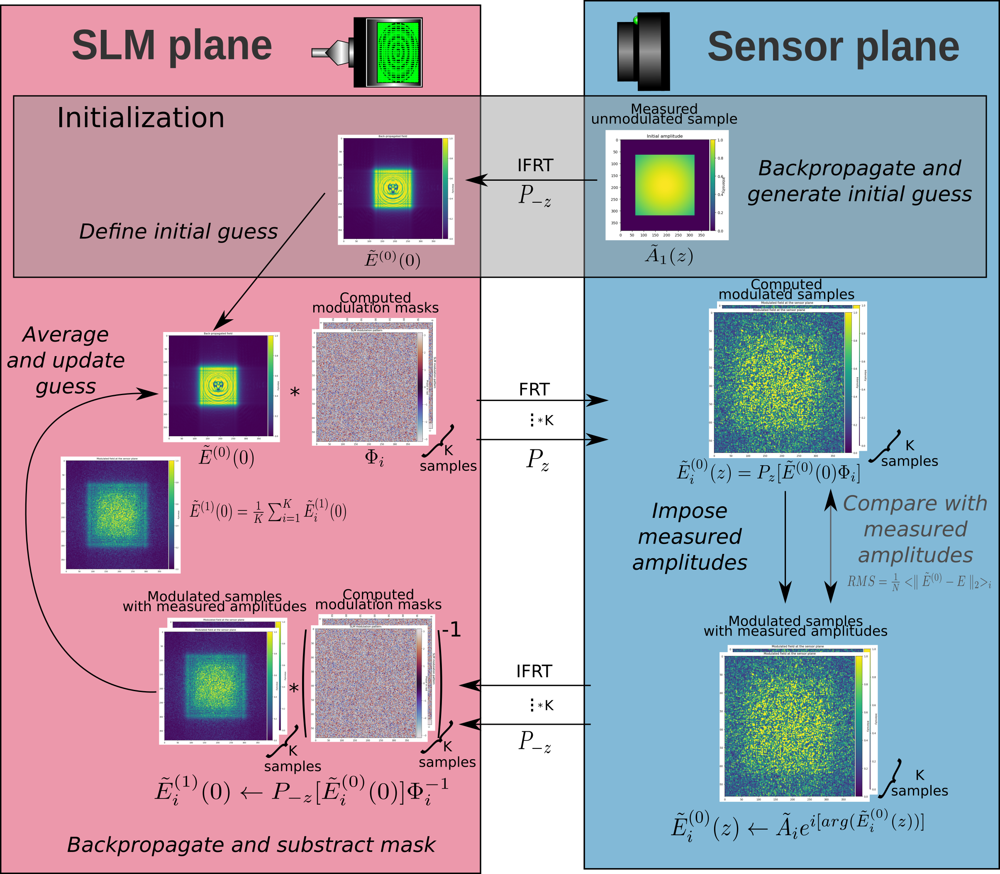

**GOAL OF THE PROJECT**

Following the work of Yicheng Wu and Ashok Veeraraghavan presented in Nature LSA, this project is a continuation of the WISH algorithm for high resolution wavefront sensing. This would in term allow full field measurement in a hot atomic vapor experiment. We very sincerely thank Yicheng for sharing his Matlab code with us !

The approach presented in the 2 references is to use the SLM to modulate the face, and then use phase retrieval algos (Gerchberg-Saxton). The main advantage is that instead of doing one single calculation through a phase retrieval algo that is not perfect, one can average over the modulation thus greatly improving the precision of the reconstruction. 

**COMPUTE CGH**

A small holographic pattern generator is available [here](ComputeCGH/compute_cgh.py). A detailed readme file explains the usage of the code.

**WISH**

In the [WISH](WISH/) folder you will find our python implementation of Yicheng Wu's Matlab code allowing replication of the results of their LSA paper. In the [dev](dev/) folder you will find the development version of our tailored version of this code. The code has a main class `WISH_lkb.py` that handles the computations. Its workflow is described in the following figure.

The simulations can be carried out using `WISH_simulation.py` and the actual measurements using `WISH_measurement.py`. Note that the latter is designed to run with a Point Grey camera, and an SLM or DMD that are handled as secondary screens. 

**CONTRIBUTION**

If you want to contribute, you are more than welcome to do so. Simply **create a new branch with you name on it**. If you do not know how to do it, simply use the GitHub webpage and click on "branches" and type the name of the branch you want to create:

**Then do not forget to checkout as this new branch !** :)
Also feel free to declare issues if you see some, the code is still far from ideal.

**PYTHON LIBS AND DEPENDENCIES** :  

The computation are mainly carried out on GPU using CUDA. For the Python front-end, [Cupy](https://cupy.dev/) is used as a drop-in replacement to run a Numpy-like API. Data acquisition is handled by an OpenCV like interface for Point Grey cameras : [EasyPySpin](https://github.com/elerac/EasyPySpin) that relies on the official Python API from FLIR, [PySpin](https://www.flir.fr/products/spinnaker-sdk/). Control of the SLM (or DMD) is handled using [PySLM](https://github.com/wavefrontshaping/slmPy).

**REFERENCES** : 

https://hal.archives-ouvertes.fr/hal-00533180/document 

https://www.nature.com/articles/s41377-019-0154-x 

http://arxiv.org/abs/1711.01176 
